# Parallel Agent Architecture

Irodori should be developed by several coding agents at once without forcing
everyone through the same files. The architecture is extension-first: core owns
contracts, connector agents own one connector repository each, and a coordinator
serializes registry and generated-catalog changes.

The machine-readable workstream definition lives in
[`registry/agent-workstreams.json`](https://github.com/hjosugi/irodori-table/blob/main/registry/agent-workstreams.json).
Validate it from an `irodori-table` checkout with:

```sh
node tools/docs/agent-workstreams.mjs
```

## Shape

```mermaid
flowchart TB
  coordinator["Coordinator agent<br/>registry + generated catalogs"]
  host["Extension host agent<br/>ABI + SDK + schema"]
  runtime["DB runtime agent<br/>sessions, streaming, cancellation"]
  migration["Migration/diff agent<br/>hashing, compare, repair SQL"]
  ui["Workbench UI agent<br/>editor, grid, panels"]
  docs["Docs agent<br/>generated docs and source docs"]
  connectorA["Connector agent A<br/>../irodori-extensions/irodori-extension-hive"]
  connectorB["Connector agent B<br/>../irodori-extensions/irodori-extension-snowflake"]
  connectorC["Connector agent C<br/>../irodori-extensions/irodori-extension-oracle"]
  registry["connector registry<br/>knowledge + marketplace JSON"]
  contracts["shared contracts<br/>extension ABI, connection profile, command API"]

  coordinator --> registry
  host --> contracts
  runtime --> contracts
  migration --> contracts
  ui --> contracts
  docs --> registry
  connectorA --> contracts
  connectorB --> contracts
  connectorC --> contracts
  connectorA -. read .-> registry
  connectorB -. read .-> registry
  connectorC -. read .-> registry
```



## Workstream Rules

| Workstream | Parallelism | Owns | Must Not Edit Directly |
| --- | --- | --- | --- |
| `connector-extension` | Repeatable; one agent per connector repo | `../irodori-extensions/{repository}/**` | Registry JSON, `knowledge/engines.json`, core Rust DB registry |
| `extension-host` | Single | Extension schema, ABI crate, TS SDK, extension host UI | Connector-specific implementation repos |
| `db-runtime` | Single | Rust DB runtime, transport, profile, streaming, cancellation | Frontend workflow files unless DTOs are agreed |
| `migration-diff` | Single | Migration studio, row hash/diff contracts, high-scale compare design | Connector registry except through coordinator |
| `workbench-ui` | Single | Workbench, query editor, result grid, styles | Rust command DTOs and generated API |
| `docs-registry` | Single | Source docs, generated docs tools, support matrix | App/runtime code without an owning code workstream |

## Connector Lane

Connector work is the main parallel lane. Each connector is its own repository
under the sibling checkout:

```sh
node tools/extensions/scaffold-connector-repos.mjs
cd ../irodori-extensions/irodori-extension-hive
make check
```

A connector agent can implement Hive, Snowflake, Oracle, Iceberg, vector DBs, or
lakehouse storage behavior without touching the desktop registry. It consumes:

- `irodori.extension.json` and `connector.config.json` generated from the
  marketplace registry.
- `native/source/` snapshots of desktop contracts.
- `../irodori-kit/irodori-connection`,
  `../irodori-kit/irodori-extension`, `../irodori-kit/irodori-connector-abi`,
  and the generated SDK as read-only contracts.

If a connector needs a new manifest field, auth mode, connection profile field,
transport mode, or native ABI call, that is not connector-local work. Open a
contract change in `extension-host`, `db-runtime`, or `coordinator` first.

## Serialized Contracts

These files are intentionally serialized because they affect every agent:

- `knowledge/engines.json`
- `registry/catalog/index.json`
- `registry/catalog/catalog.json`
- `registry/catalog/connector-repositories.json`
- `apps/desktop/src-tauri/src/db/engine.rs`
- `apps/desktop/src-tauri/src/db/profile.rs`
- `../irodori-kit/irodori-extension/**`
- `../irodori-kit/irodori-connector-abi/**`
- `../irodori-kit/packages/extension-sdk/**`
- `../irodori-kit/packages/extension-sdk/extension.schema.json`
- `apps/desktop/src/generated/**`

Only the owning workstream should write them. Other agents should treat them as
inputs and ask for a contract update when needed.

## Local Worktree Layout

Use separate worktrees for app work and separate connector directories for
connector work:

```sh
git worktree add ../irodori-table-ui -b agent/workbench-ui
git worktree add ../irodori-table-runtime -b agent/db-runtime
git worktree add ../irodori-table-migration -b agent/migration-diff

node tools/extensions/scaffold-connector-repos.mjs
cd ../irodori-extensions/irodori-extension-snowflake
```

This keeps `apps/desktop/src/app/AppWorkbench.tsx`, generated files, and registry
JSON out of normal connector branches.

## Merge Order

1. Coordinator lands registry/marketplace/engine metadata updates.
2. Extension-host lands ABI or manifest schema changes.
3. DB-runtime lands command/profile/transport changes and regenerates bindings.
4. Connector agents update their repositories against the stable contracts.
5. UI/migration agents consume generated APIs and connector capabilities.

The order only matters when contracts change. Pure connector implementation
inside one `../irodori-extensions/irodori-extension-*` repo can merge
independently.

## Required Checks

Run the narrow check for the owning workstream, then the shared registry checks
when touching contracts:

```sh
node tools/docs/agent-workstreams.mjs
node tools/docs/build-extension-catalog.mjs --check
node tools/docs/support-status.mjs
make extension-manifests
npm --prefix apps/desktop run build
cargo test --manifest-path apps/desktop/src-tauri/Cargo.toml db::engine
```
